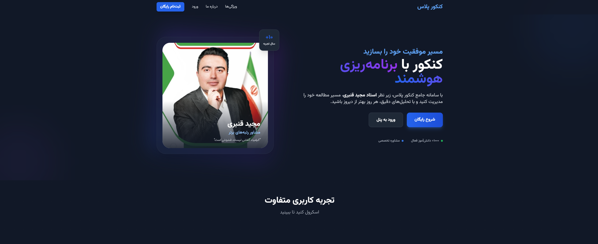

# KONKOOR - Comprehensive Educational Management & Academic Counseling Platform

<p align="center">
  
</p>

**KONKOOR** is an open-source, production-ready, full-stack web platform designed to streamline and manage the academic counseling process for students and advisors. Built with a robust **Laravel 11** backend and a highly interactive **React 18** frontend, the platform is fully optimized for serverless deployments and scalable cloud infrastructures.

🌐 **Live Demo:** [konkoor-kohl.vercel.app](https://konkoor-kohl.vercel.app)

---

## 🚀 Key Features

* **📚 Study Plan Management:** Dynamic scheduling and personalized curriculum tracking for students.
* **📊 Daily Progress Reporting:** Advanced analytical insights and performance reporting workflows.
* **📝 Online Examination System:** Secure, real-time testing and evaluation environment.
* **💰 Financial & Payment Management:** Complete ledger control for transaction handling and financial tracking.
* **👥 Role-Based Access Control (RBAC):** Granular permission management integrated via Spatie, separating students, advisors, and administrators.
* **⚡ Serverless-Ready Architecture:** Pre-configured blueprints for serverless execution and cloud hosting.

---

## 🛠️ Tech Stack

### Backend Infrastructure
* **Core Framework:** PHP 8.2+ / Laravel 11
* **Database & Caching:** MySQL 8.0 + Redis
* **Authentication:** Laravel Sanctum
* **Authorization:** Spatie Permission (RBAC)

### Frontend Layer
* **Core Library:** React 18 / Vite
* **Styling & Components:** Tailwind CSS + Shadcn/ui
* **Pre-processing:** PostCSS

### DevOps & Cloud Deployment
* **Serverless Blueprint:** Vercel (`vercel.json` with serverless PHP runtime injection)
* **Cloud Orchestration:** Railway Cloud (`railway.toml` + `nixpacks.toml`)
* **Automation Automation:** Custom cross-platform deployment scripts (`deploy.sh` & `git_push_auto.bat`)

---

## 📁 Repository Structure Overview

```text
├── api/                  # Serverless API gateways tailored for Vercel functions
├── app/                  # Core Laravel application logic (Models, Controllers, Services)
├── bootstrap/            # Application autoloading and framework bootstrap configs
├── config/               # Application configuration architecture
├── database/             # Database migrations, seeders, and model factories
├── public/               # Publicly accessible assets and frontend entry points
├── resources/            # Frontend core assets (React components, raw CSS, Views)
├── routes/               # Clean API and Web routing definitions
├── storage/              # System logs and file caching layers
├── vercel.json           # Vercel deployment specifications
└── railway.toml          # Cloud container environment configurations
